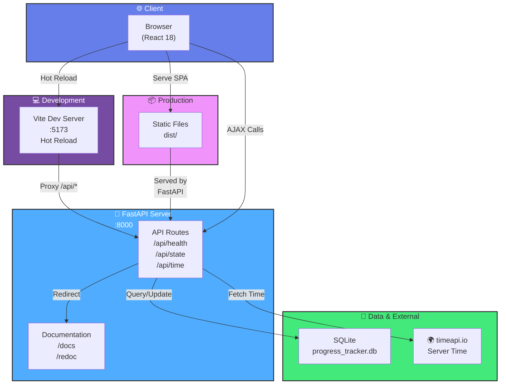

# Progress Tracker

Progress Tracker is a gamified routine app focused on consistency and progression.

It helps users track daily habits (gym, study, running, flexibility, and custom activities), earn points, level up, maintain streaks, and review recent performance.

## Features

- Daily checklist with per-activity completion
- Custom points per activity (1-100)
- Weighted daily scoring based on completed vs missed points
- Perfect-day bonus
- Missed-day penalty between check-ins
- Level system with circular progress
- Shield progression tiers (1 shield tier every 16 levels)
- Current streak and best streak
- Weekly scheduling per activity
- Last 30 check-ins history with quick metrics
- Dev-only simulation controls (hidden in production)

## Tech Stack

- React 18
- Vite 5
- FastAPI
- SQLite
- Poetry (Python dependency management)
- Vitest
- localStorage fallback when API is unavailable

## Architecture Diagram



## Getting Started

```bash
npm install
poetry install
```

## Run Modes

### Development (hot reload)

Run both API + frontend in one terminal:

```bash
npm run dev
```

Optional (split terminals):

Terminal 1 (API):

```bash
npm run api
```

Terminal 2 (frontend):

```bash
npm run dev:web
```

URLs:

- Frontend: `http://localhost:5173` (or next free Vite port)
- API health: `http://localhost:8000/api/health`
- API time: `http://localhost:8000/api/time`
- API docs (Swagger UI): `http://localhost:8000/docs`
- API docs (ReDoc): `http://localhost:8000/redoc`

Notes:

- In dev, Vite proxies `/api/*` to FastAPI on port `8000`.
- `Ctrl + C` in `npm run dev` stops both API and frontend.

### Production (without Docker)

```bash
npm run prod
```

URL:

- App + API on same port: `http://localhost:8000`
- API docs (Swagger UI): `http://localhost:8000/docs`
- API docs (ReDoc): `http://localhost:8000/redoc`

### Production (Docker, recommended for Raspberry Pi)

```bash
cp .env.example .env
docker compose up -d --build
```

URL:

- App + API on same port: `http://localhost:8000`
- API docs (Swagger UI): `http://localhost:8000/docs`
- API docs (ReDoc): `http://localhost:8000/redoc`

Useful commands:

- Logs: `docker compose logs -f`
- Stop: `docker compose down`

## What the API is for

The API is the persistence and serving layer for the app.

- Stores user progress in SQLite (`/api/state`)
- Returns saved state to the frontend on app load
- Saves all updates from the frontend so data survives browser cache cleanup
- Exposes a health endpoint (`/api/health`) for monitoring
- Exposes server time for day rollover logic (`/api/time`)
- Redirects API root (`/api`) to docs (`/docs`)
- Serves the production frontend static files (`/` and `/assets/*`) in production mode

In short:

- Frontend handles UI and interactions
- API handles storage, retrieval, and production delivery

## Available Scripts

```bash
npm run dev
npm run dev:web
npm run api
npm run test
npm run build
npm run preview
npm run prod
```

## Production Workflow

- `npm run build`: builds static production assets into `dist/`
- `npm run api`: starts FastAPI + SQLite backend via Poetry on port 8000
- `npm run preview`: serves only the built frontend locally
- `npm run prod`: runs build and starts FastAPI (frontend + API + DB)

## Backend with Poetry

Run API directly with Poetry:

```bash
poetry run uvicorn backend.main:app --host 0.0.0.0 --port 8000
```

Backend configuration (optional env vars):

- `HOST` (default: `0.0.0.0`)
- `PORT` (default: `8000`)
- `DB_PATH` (default: `backend/data/progress_tracker.db`)
- `DIST_DIR` (default: `dist`)
- `TIME_API_BASE_URL` (default: `https://timeapi.io/api/Time/current/zone`)
- `TIME_API_TIMEZONE` (default: `UTC`)

## Scoring Rules

Core logic lives in `src/utils/progression.js`.

- Daily points are calculated from completed activity points
- Incomplete day penalty is weighted:
	- `missedPoints = totalPoints - donePoints`
	- `penalty = round(missedPoints * 0.6)`
	- `dailyDelta = donePoints - penalty`
- Perfect day bonus: `+30`
- Points never go below zero

Day rollover and history recomputation use server date from `/api/time`.

## Data Model

Primary persistence uses SQLite on the backend (`backend/data/progress_tracker.db`).

Frontend state can still fallback to localStorage (`progress-tracker-v1`) if the API is not reachable.

Stored state shape:

- `activities`: name, points, selected weekdays
- `checksByDate`: completion map by date
- `history`: recent daily results (last 30 entries)
- `points`, `streak`, `longestStreak`, `lastCheckInDate`

## Dev vs Prod Behavior

Developer controls are gated with `import.meta.env.DEV`:

- Available in `npm run dev`
- Not available to end users in production builds

## Running on Raspberry Pi

1. Install Node.js and Python 3.11+ on the Raspberry Pi.
2. Install frontend dependencies:

```bash
npm install
```

3. Install backend dependencies:

```bash
poetry install
```

4. Start in production mode:

```bash
npm run prod
```

The app will be available on port `8000` by default and data will be stored locally in SQLite on the Pi.

## Docker Deployment

Build and run with Docker:

```bash
docker build -t progress-tracker .
docker run -d -p 8000:8000 -v progress_tracker_data:/data --name progress-tracker progress-tracker
```

Or use Docker Compose:

```bash
cp .env.example .env
docker compose up -d --build
```

The app is fully production-mode inside one container:

- Frontend is built with Vite (`dist/`) during image build
- FastAPI serves both API routes (`/api/*`) and frontend static files (`/` and `/assets/*`)
- SQLite is used as the primary persistence

### SQLite Storage Explained (Important)

With Docker Compose in this project, SQLite is persisted via bind mount:

- Host folder: `./docker-data`
- Container folder: `/data`
- Database file (inside container): `/data/progress_tracker.db`
- Database file (host): `./docker-data/progress_tracker.db`

What this means on each machine:

- On your current Windows test PC, data is stored in your project folder under `docker-data/progress_tracker.db`
- On Raspberry Pi (Linux), data will be stored in that same relative project folder under `docker-data/progress_tracker.db`

So data does **not** go to Supabase and does **not** stay inside ephemeral container layers.

If you remove containers only, data remains.
If you delete `docker-data/`, you delete your SQLite data.

### Manual Configuration (easy tweaks)

Edit `.env`:

- `APP_PORT` => host port (e.g. `8000`, `8080`)
- `SERVICE_PORT` => internal app port inside container
- `SQLITE_DATA_DIR` => host folder that stores database
- `DB_PATH` => DB path inside container (keep `/data/progress_tracker.db` unless needed)

After changing `.env`, apply:

```bash
docker compose up -d --build
```

## Project Structure

```text
src/
	App.jsx
	styles.css
	main.jsx
	utils/
		progression.js
		progression.test.js
```

## Testing

```bash
npm run test
```

## Build

```bash
npm run build
```

## Next Improvements

- Add optional cloud sync/authentication
- Add richer weekly/monthly charts
- Add export/import for user progress
